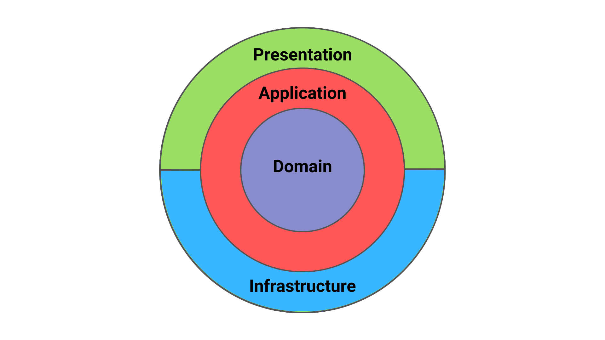

# Todo Clean - Clean Architecture / DDD avec Vue 3

Une application Todo List simple démontrant les principes de **Clean Architecture** et **Domain-Driven Design (DDD)** avec Vue 3 et TypeScript.

## Fonctionnalités

- Créer des tâches avec un titre
- Marquer une tâche comme terminée/non terminée
- Supprimer une tâche
- Afficher la liste des tâches
- Persistance en mémoire (InMemoryRepository)

## Prérequis

- Node.js ^20.19.0 ou >=22.12.0
- npm

## Lancer l'application

### Installation
```bash
npm install
```

### Lancer en développement
```bash
npm run dev
```
L'application s'ouvrira sur http://localhost:5173

## Lancer les tests

```bash
npm run test
```

Des tests unitaires couvrent:
- **Domain** : Entité `Task` et Value Object `TaskTitle`
- **Application** : Tous les use cases (`CreateTask`, `ListTasks`, `DeleteTask`, `ToggleTaskStatus`)

## Choix d'architecture

### Clean Architecture 

Le projet est structuré en couches indépendantes:

```
src/
├── domain/           # Coeur métier (entités, value objects, interfaces)
├── application/      # Use cases (orchestration de la logique)
├── infrastructure/   # Implémentations techniques (repository)
└── ui/               # Présentation (Vue 3, composants)
```

Je me suis inspiré de ça :



J'ai conscience que ce n'est pas la seule façon de faire (on peut réunir Infrastructure et Presentation dans la même couche par exemple). Mais j'ai préféré faire comme ça pour que chaque couche ait bien sa responsabilité claire de définie.

**Avantages:**
- **Testabilité** : La logique métier est testable indépendamment de Vue et de la persistance
- **Maintenabilité** : Chaque couche a une responsabilité unique
- **Flexibilité** : On peut remplacer le repository en mémoire par une BD sans modifier le domaine

### Domain-Driven Design (DDD)

- **Entité riche** (`Task`) : Encapsule la logique métier (`markAsDone()`, `markAsTodo()`)
- **Value Objects** (`TaskId`, `TaskTitle`) : Identifiés par leur valeur, immuables et validés à la création
- **Repository Pattern** : Interface `TaskRepository` isole l'accès aux données
- **Use Cases** : Chaque opération métier est un use case explicite

### Résultat

Les composants Vue ne contiennent aucune logique métier. Tout est délégué aux use cases via le composable `useTasks()`.
